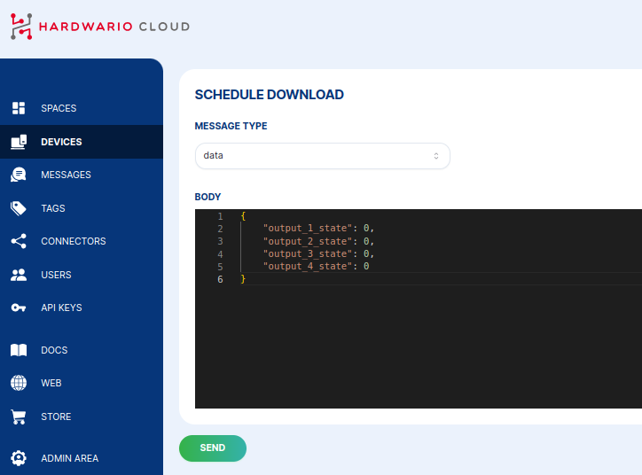

import Image from '@theme/IdealImage';

# Downlink

In the web interface or over API you can send downlink messages:

- Data
- Config
- Commands (in the future)

## Data

You can send JSON commands that the device will decode and your code will receive structure with a filled data.

## Config

You can configure the device the same way as you configure it over BLE or J-Link RTT. Just send for example `app config interval-report 600` command and CHESTER will apply the new configuration when it sends an uplink packet or polls for the new data.



## API Examples

### Data

```bash
#/bin/bash

# Run with
# API_KEY="xxx" DEVICE_ID="xxx" ./codec/control.sh

set -x

curl -X 'POST' \
  'https://api.prod.hardwario.cloud/v2/messages' \
  -H 'accept: application/json' \
  -H "Authorization: ApiKey $API_KEY" \
  -H 'Content-Type: application/json' \
  -d '{
"body": {
  "output_1_state": 0,
  "output_2_state": 0,
  "output_3_state": 0,
  "output_4_state": 0
},
  "device_id": "'"$DEVICE_ID"'",
  "type": "data"
}'
```

### Config

```bash
#/bin/bash

# Run with
# API_KEY="xxx" DEVICE_ID="xxx" ./codec/config.sh

set -x

curl -X 'POST' \
  'https://api.prod.hardwario.cloud/v2/messages' \
  -H 'accept: application/json' \
  -H "Authorization: ApiKey $API_KEY" \
  -H 'Content-Type: application/json' \
  -d '{
"body": [
    "app config analog-interval-sample 60",
    "app config analog-interval-aggreg 300",
],
  "device_id": "'"$DEVICE_ID"'",
  "type": "config"
}'
```
